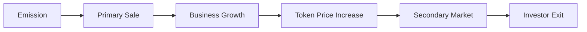

```markdown
---
# 🌐 **TokenizeLocal**  
## **Tokenization of Small Businesses with Automated Dividend Payouts**
---
### 🔍 1. Problem  
Small and medium-sized businesses face several challenges:
| Problem | Description |
|--------|-----------|
| Lack of investment | Banks are reluctant to lend, and funds ignore small projects. |
| Liquidity of business share | Investors find it difficult to exit or sell their stake. |
| Trust in data | Financial reporting is often unavailable or opaque. |
| Profit distribution | No mechanism for automatic distribution of income among investors. |
---
### 💡 2. Solution  
**TokenizeLocal** is a platform for tokenizing business shares through a centralized database-based system. It enables:
- Businesses to issue tokens linked to a portion of their revenue.
- Investors to purchase tokens and receive **monthly dividends**.
- The platform to evolve from a simple database to a blockchain ecosystem.
---
### 📈 3. How It Works?
#### For a business:
1. **Registration by INN** → Company status is verified via the Checko API.
2. **Token issuance** → Number of tokens and revenue share percentage are defined.
3. **Revenue data update** → Revenue information is submitted to the system.
4. **Automatic dividend distribution** → Amount is distributed among all token holders.
#### For a user / investor:
1. **Registration / Authentication** → Email + password.
2. **Select a business** → View companies and available tokens.
3. **Purchase tokens** → User receives tokens.
4. **Monthly dividends** → Payouts proportional to the number of tokens held.
---
### 🧩 4. Project Structure  
Initially, the system is built on a centralized database (`SQLite`) with future scalability:
- **blockchain/db_manager.py** — Manages businesses, tokens, and user balances.
- **verification/api_client.py** — Verifies company status via Checko API.
- **utils/logger.py** — Event logging.
- **main.py** — Entry point, implements all business logic.
- **blockchain/users.py** — User registration and authentication.
- **blockchain/records_check.py** — Database content verification.
---
### 📁 5. Database Tables
| Table | Description |
|------|-----------|
| `businesses` | Stores company INN and name |
| `token_issuances` | Number of issued tokens |
| `users` | Email, name, password |
| `user_tokens` | User token balances |
| `dividend_history` | Dividend payment history |
---
### 🧠 6. Key Benefits
| For Business | For Investor |
|-------------|-------------|
| Alternative to bank loans | Low entry threshold — can buy 1 token |
| Global access to investors | Passive income from real revenue |
| Automatic dividend payments | Token value grows as business grows |
| Financial data transparency | Access to company info via API |
| Ability to buy back tokens | Exit via secondary market (in future) |
---
### 📊 7. Economic Model
#### Dividend Mechanism:
Each token grants a right to a share of monthly dividends calculated by the formula:
$$
\text{Dividend per token} = \frac{\text{Business Revenue} \times \text{Profit Share}}{\text{Total Number of Tokens}}
$$
##### Example:
- Revenue: $10,000
- Profit Share: 10%
- Tokens: 10,000
- Dividend per token: $0.10
- Investor with 1,000 tokens receives: $100/month → **ROI 10% per month**
> 💡 As business and revenue grow — dividends and token price increase.
---
### 🚀 8. Token Development Path

---
### 🧠 9. How Can This Be Improved?
| Improvement | Description |
|-----------|-----------|
| Secondary market | Allow investors to trade tokens, increasing liquidity |
| Blockchain integration | Transition to decentralized system for transparency and security |
| Open Banking | Verify revenue via bank APIs, not only Checko |
| Token insurance | Protection against business bankruptcy |
| DAO governance | Investor voting on business development |
---
### 📈 10. Competitive Advantages
| Advantage | Implementation |
|----------|----------------|
| Transparency | All data visible in DB and accessible via Telegram bot |
| Automatic dividends | Monthly payouts without manual intervention |
| Centralized model | Fast launch, low costs |
| Regulatory compliance | Issuance via SPV in jurisdictions with clear compliance |
| Model flexibility | Adaptable to any niche — from cafes to solar plants |
---
### 💸 11. Platform Monetization
| Revenue Source | Description |
|---------------|-----------|
| Issuance fee | 0.5–1% of token volume |
| Purchase fee | 0.5–1% |
| Resale fee | 0.1–0.5% |
| Premium listing | $500–$1,000 for featuring on homepage |
| Analytics | $10–$50/month for extended reports |
| Affiliate program | 2–5% commission per referred participant |
---
### 🌍 12. Target Audience
| Category | Description |
|--------|-----------|
| Small businesses | Cafes, shops, vending, solar stations |
| Individual investors | People wanting to invest in real economy |
| Crowdfunding platforms | Integration with existing systems |
| DAO communities | Collective asset management |
| RWA funds | Funds seeking diversification |
---
### 🚀 13. Scalability Opportunities
| Step | Action |
|-----|-------|
| CLI MVP | Fully functional |
| Web version | FastAPI / Flask + React |
| Secondary market | DEX built on top of tokens |
| Blockchain | Issuance via smart contracts |
| DAO | Voting on business development |
| Global Market | Support for multiple countries |
---
### 📉 14. Risks and Mitigation Strategies
| Risk | Solution |
|------|---------|
| Legal complexities | Operate via SPV in regulated jurisdictions |
| Financial fraud | Verification via Open Banking |
| Incorrect revenue data | Use of oracles |
| Dependence on a single API | Add mock data and integrate other APIs |
| High entry barrier | Minimum investment — $100 |
| Investor exit | Secondary token market |
| Technical failures | Database backups, redundancy |
| Business-side fraud | Verification via API and documents |
| Regulatory changes | Flexible model, operate through compliant jurisdictions |
---
### 🌐 15. Support for Global APIs to Verify Businesses
Currently, the platform is **fully integrated with Checko API** and supports **company verification by INN in the Russian Federation**. This allows fast and reliable verification of company status and access to revenue data.
**In the near-term scaling plan**, geographic expansion and support for international businesses are planned via:
| Region | Identifier | API |
|-------|------------|-----|
| Russia | INN | Checko |
| EU | VAT ID | VIES (VAT Information Exchange System) |
| USA | EIN | Dun & Bradstreet, OpenCorporates |
| Asia | BRN / CRN | Local Business Registries (e.g., Singapore ACRA, Japan Teikoku) |
#### Integration Plan:
1. **EU (VAT ID)** — 1–2 months: Verify company status and EU registration.
2. **USA (EIN)** — 2–3 months: Integration with Dun & Bradstreet and IRS.
3. **Asia** — 3–6 months: Support for Singapore, Japan, UAE.
4. **Global** — OpenCorporates for all other countries.
> ✅ This will allow investors to purchase tokens **not only from Russian but also international businesses**, making the platform global.
---
### 💸 16. Multi-Currency Support
| Supported Currencies | Description |
|----------------------|-----------|
| RUB | Russian Ruble |
| USD | US Dollar |
| EUR | Euro |
| USDT | Stablecoin (TRC20, ERC20) |
| USDC | Stablecoin (ERC20) |
| ETH | Ethereum |
| BTC | Bitcoin |
> ✅ At launch — RUB and USD.  
> 🚀 In the future — stablecoin support to minimize volatility.
---
### 📈 17. Growth Forecast
| Period | Businesses | Investors | Revenue |
|-------|-----------|----------|--------|
| Year 1 | 100 | 10,000 | $1M+ |
| Year 2 | 1,000 | 100,000 | $10M+ |
| Year 3 | 10,000 | 1M+ | $100M+ |
---
### 📊 18. Tokens as Small Business Shares
| Parameter | TokenizeLocal |
|---------|---------------|
| Dividends | Yes, monthly |
| Equity participation | Yes, via tokens |
| Secondary market | Planned |
| Passive income | Yes |
| Decentralization | Planned via blockchain |
| Risk | Moderate, business can be verified |
| ROI | 10–20% per month (depending on business) |
---
### ✨ 19. Unique Value Proposition
| What We Do | How We Differ |
|----------|---------------|
| Business tokenization | Not just large assets, but cafes, vending, solar energy |
| Centralized model | Fast launch, low cost |
| Dividend payouts | Proportional to token holdings |
| Blockchain-ready | Can migrate to Polygon / TON |
| Investor convenience | View tokens and dividends easily |
---
### 📈 20. Conclusion
- ✔️ **RWA is becoming one of the fastest-growing areas in DeFi**.
- ✔️ **Small business is a vast, underappreciated market**.
- ✔️ **Automated profit distribution ensures high liquidity**.
- ✔️ **Can start in Russia, then scale globally**.
---
### 📦 21. What Could Be Added Next?
| Feature | Description |
|--------|-----------|
| **Tokens as NFTs** | Unique dividend rights |
| **DAO governance** | Voting on business development |
| **Yield charts** | For analysis and selection |
| **Multi-currency support** | RUB, USD, USDT, USDC |
| **Automatic token buyback** | Business can repurchase its own tokens |
| **Token insurance** | Protection against bankruptcy |
| **Blockchain integration** | For security and transparency |
---
### 📈 22. Scaling Roadmap
| Step | What to Implement |
|-----|------------------|
| 1. CLI MVP | Now |
| 2. REST API | 1 month |
| 3. GUI Interface | 2 months |
| 4. Blockchain | 5–6 months |
| 5. DAO | 7–9 months |
| 6. Secondary Market | 10–12 months |
---
### 📁 23. Final Project Structure
```text
tokenize_local/
├── README.md
├── requirements.txt
├── .env
├── main.py
├── blockchain/
│   ├── db_manager.py       # Token issuance and dividends
│   ├── register_user.py    # User registration
│   └── records_check.py    # Database content verification
├── verification/
│   └── api_client.py       # Company verification via Checko
├── utils/
│   └── logger.py           # Action logging
└── tests/
```