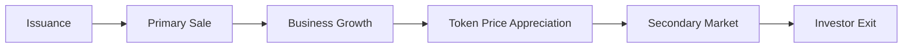

---

## 🌐 **TokenizeLocal**  
## **Tokenizing Small Businesses with Automatic Dividend Payouts**  

---  

### 🔍 1. The Problem  
Small and medium-sized businesses face several challenges:  

| Problem | Description |  
|---------|--------|  
| Lack of Investment | Banks are reluctant to lend, and funds often ignore small projects. |  
| Liquidity of Business Shares | Investors struggle to exit deals or sell their stakes. |  
| Trust in Data | Financial reporting is often inaccessible or opaque. |  
| Profit Distribution | No mechanism for automatically distributing income among investors. |  

---  

### 💡 2. The Solution  

**TokenizeLocal** is a platform for tokenizing business shares via a centralized database system. It enables:  
- Businesses to issue tokens tied to a share of their revenue.  
- Investors to buy tokens and receive **monthly dividends**.  
- The platform to evolve from a simple DB to a blockchain ecosystem.  

---  

### 📈 3. How It Works?  

#### For Businesses:  
1. **Registration via Tax ID (INN)** → Verification via Checko API.  
2. **Token Issuance** → Define the number of tokens and the revenue share for dividends.  
3. **Profit Data Updates** → Revenue data is submitted to the system.  
4. **Automatic Dividend Distribution** → Dividends are split among token holders.  

#### For Users / Investors:  
1. **Registration/Login** → Email + password.  
2. **Business Selection** → Browse companies and available tokens.  
3. **Token Purchase** → Acquire tokens.  
4. **Monthly Dividends** → Payouts proportional to token holdings.  

---  

### 🧩 4. Project Structure  
Initially, the system is built on a centralized database (`SQLite`) with future scalability:  
- **blockchain/db_manager.py** → Manages companies, tokens, and user balances.  
- **verification/api_client.py** → Verifies company status via Checko API.  
- **utils/logger.py** → Event logging.  
- **main.py** → Entry point, implements core business logic.  
- **blockchain/users.py** → User registration and authentication.  
- **blockchain/records_check.py** → Database content verification.  

---  

### 📁 5. Database Tables  

| Table | Description |  
|--------|--------|  
| `businesses` | Stores Tax ID (INN) and company name |  
| `token_issuances` | Number of issued tokens |  
| `users` | Email, name, password |  
| `user_tokens` | User token balances |  
| `dividend_history` | Dividend payout history |  

---  

### 🧠 6. Key Benefits  

| For Businesses | For Investors |  
|-----------|-------------|  
| Alternative to bank loans | Low entry barrier—buy as little as 1 token |  
| Global investor access | Passive income from real revenue |  
| Automatic dividend payouts | Potential token appreciation as the business grows |  
| Transparent financial data | Access to company data via API |  
| Token buyback option | Future secondary market liquidity |  

---  

### 📊 7. Economic Model  

#### Dividend Mechanics:  
Each token grants a share of monthly dividends, calculated as:  

$$
\text{Dividend per Token} = \frac{\text{Business Revenue} \times \text{Profit Share}}{\text{Total Tokens Issued}}
$$

##### Example:  
- Revenue: $10,000  
- Profit Share: 10%  
- Tokens Issued: 10,000  
- Dividend per Token: $0.10  
- Investor with 1,000 tokens earns: $100/month → **10% monthly ROI**  

> 💡 As the business grows, dividends and token value increase.  

---  

### 🚀 8. Token Growth Path  



---  

### 🧠 9. Potential Improvements  

| Improvement | Description |  
|---------|--------|  
| Secondary Market | Enable peer-to-peer token sales for liquidity |  
| Blockchain Integration | Transition to a decentralized system for transparency |  
| Open Banking | Verify revenue via banking APIs, not just Checko |  
| Token Insurance | Protect against business bankruptcy |  
| DAO Governance | Investor voting for business decisions |  

---  

### 📈 10. Competitive Advantages  

| Advantage | Implementation |  
|------------|-----------|  
| Transparency | All data visible in the DB and accessible via Telegram bot |  
| Automatic Dividends | Monthly payouts, no manual intervention |  
| Centralized Model | Fast launch, low costs |  
| Regulatory Compliance | Operate via SPVs in compliant jurisdictions |  
| Model Flexibility | Adaptable to niches—cafés, solar farms, etc. |  

---  

### 💸 11. Monetization  

| Revenue Stream | Description |  
|----------------|--------|  
| Issuance Fee | 0.5–1% of token volume |  
| Purchase Fee | 0.5–1% |  
| Resale Fee | 0.1–0.5% |  
| Premium Listings | $500–$1,000 for featured placement |  
| Analytics | $10–$50/month for advanced reports |  
| Referral Program | 2–5% per recruited participant |  

---  

### 🌍 12. Target Audience  

| Category | Description |  
|----------|--------|  
| Small Businesses | Cafés, retail stores, vending, solar farms |  
| Retail Investors | Individuals investing in real-world assets |  
| Crowdfunding Platforms | Integration with existing systems |  
| DAOs | Collective asset management |  
| RWA Funds | Diversification into tokenized assets |  

---  

### 🚀 13. Scaling Roadmap  

| Step | Action |  
|-----|-----------|  
| CLI MVP | Live now |  
| Web Version | FastAPI/Flask + React |  
| Secondary Market | DEX for tokens |  
| Blockchain | Smart contract integration |  
| DAO | Investor governance |  
| Global Expansion | Multi-country support |  

---  

### 📉 14. Risks & Mitigations  

| Risk | Solution |  
|------|--------|  
| Legal Hurdles | Operate via SPVs in regulated jurisdictions |  
| Fraud | Open Banking verification |  
| Inaccurate Revenue Data | Oracle integration |  
| API Dependency | Mock data + multiple APIs |  
| High Entry Barrier | Minimum investment: $100 |  
| Investor Exit | Secondary token market |  
| Technical Failures | DB backups |  
| Business Fraud | API + document verification |  
| Regulatory Changes | Flexible model, compliant jurisdictions |  

---  

### 🌐 15. Global Business Verification APIs  

Currently, the platform is **fully integrated with Checko API**, supporting **Russian business verification via Tax ID (INN)**. This ensures quick and reliable company status checks.  

**Near-term scaling plans** include international expansion via:  

| Region | Identifier | API |  
|-------|--------------|-----|  
| Russia | INN | Checko |  
| EU | VAT ID | VIES |  
| USA | EIN | Dun & Bradstreet, OpenCorporates |  
| Asia | BRN/CRN | Local registries (e.g., Singapore ACRA, Japan Teikoku) |  

#### Integration Plan:  
1. **EU (VAT ID)** → 1–2 months: Verify EU registration.  
2. **USA (EIN)** → 2–3 months: Integrate Dun & Bradstreet + IRS.  
3. **Asia** → 3–6 months: Support Singapore, Japan, UAE.  
4. **Global** → OpenCorporates for other countries.  

> ✅ This will allow investors to buy tokens in **not just Russian but global businesses**, making the platform truly international.  

---  

### 💸 16. Multi-Currency Support  

| Supported Currencies | Description |  
|----------------------|--------|  
| RUB | Russian Ruble |  
| USD | US Dollar |  
| EUR | Euro |  
| USDT | Stablecoin (TRC20, ERC20) |  
| USDC | Stablecoin (ERC20) |  
| ETH | Ethereum |  
| BTC | Bitcoin |  

> ✅ Initially: RUB and USD.  
> 🚀 Future: Stablecoins to minimize volatility.  

---  

### 📈 17. Growth Forecast  

| Period | Businesses | Investors | Revenue |  
|-------|--------|----------|-------|  
| Year 1 | 100 | 10,000 | $1M+ |  
| Year 2 | 1,000 | 100,000 | $10M+ |  
| Year 3 | 10,000 | 1M+ | $100M+ |  

---  

### 📊 18. Tokens as Small Business Shares  

| Parameter | TokenizeLocal |  
|---------|---------------|  
| Dividends | Yes, monthly |  
| Equity Stake | Yes, via tokens |  
| Secondary Market | Planned |  
| Passive Income | Yes |  
| Decentralization | Future blockchain integration |  
| Risk | Moderate, verifiable businesses |  
| ROI | 10–20% monthly (business-dependent) |  

---  

### ✨ 19. Unique Value Proposition  

| What We Do | How We Differ |  
|----------|---------------|  
| Business Tokenization | Not just large assets—cafés, vending, solar |  
| Centralized Model | Fast, low-cost launch |  
| Dividend Payouts | Proportional to holdings |  
| Blockchain-Ready | Future migration to Polygon/TON |  
| Investor Convenience | Track tokens & dividends in one place |  

---  

### 📈 20. Summary  

- ✔️ **RWA is one of DeFi’s fastest-growing sectors**.  
- ✔️ **Small businesses—a massive, undervalued market**.  
- ✔️ **Automatic profit sharing—high liquidity**.  
- ✔️ **Start in Russia, scale globally**.  

---  

### 📦 21. Future Additions  

| Feature | Description |  
|--------|--------|  
| **NFT Tokens** | Unique dividend rights |  
| **DAO Governance** | Investor voting |  
| **ROI Analytics** | Performance graphs |  
| **Multi-Currency** | RUB, USD, USDT, USDC |  
| **Token Buybacks** | Businesses repurchasing tokens |  
| **Token Insurance** | Bankruptcy protection |  
| **Blockchain Integration** | Transparency & security |  

---  

### 📈 22. Scaling Plan  

| Step | Action |  
|-----|----------------|  
| 1. CLI MVP | Now |  
| 2. REST API | 1 month |  
| 3. GUI | 2 months |  
| 4. Blockchain | 5–6 months |  
| 5. DAO | 7–9 months |  
| 6. Secondary Market | 10–12 months |  

---  

### 📁 23. Final Project Structure  

```text  
tokenize_local/  
├── README.md  
├── requirements.txt  
├── .env  
├── main.py  
├── blockchain/  
│   ├── db_manager.py       # Token issuance & dividends  
│   ├── register_user.py    # User registration  
│   └── records_check.py    # DB content checks  
├── verification/  
│   └── api_client.py       # Checko API verification  
├── utils/  
│   └── logger.py           # Action logging  
└── tests/  
```  

---
