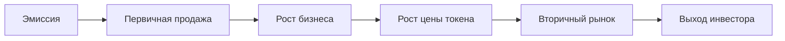

---

# 🌐 **TokenizeLocal**  
## **Токенизация малого бизнеса с автоматическими выплатами дивидендов**

---

### 🔍 1. Проблема  
Малый и средний бизнес сталкивается с рядом проблем:

| Проблема | Описание |
|---------|--------|
| Недостаток инвестиций | Банки неохотно кредитуют, а фонды игнорируют небольшие проекты. |
| Ликвидность доли бизнеса | Инвесторам сложно выйти из сделки или продать свою долю. |
| Доверие к данным | Финансовая отчётность часто недоступна или непрозрачна. |
| Выплата прибыли | Нет механизма автоматического распределения доходов между инвесторами. |

---

### 💡 2. Решение

**TokenizeLocal** — это платформа для токенизации долей бизнеса через централизованную систему на основе базы данных. Она позволяет:
- Бизнесу выпускать токены, привязанные к доле его выручки.
- Инвесторам покупать токены и получать **ежемесячные дивиденды**.
- Платформе расти от простой БД до блокчейн-экосистемы.

---

### 📈 3. Как это работает?

#### Для бизнеса:
1. **Регистрация по ИНН** → через Checko API проверяется статус компании.
2. **Выпуск токенов** → определяется количество и процент выручки, который будет распределяться.
3. **Обновление данных о прибыли** → данные о выручке передаются в систему.
4. **Автоматическое распределение дивидендов** → сумма делится между всеми держателями токенов.

#### Для пользователя / инвестора:
1. **Регистрация/авторизация** → email + пароль.
2. **Выбор бизнеса** → просмотр компаний и доступных токенов.
3. **Покупка токенов** → пользователь получает токены.
4. **Ежемесячные дивиденды** → выплаты пропорциональны количеству токенов.

---

### 🧩 4. Структура проекта  
На старте система построена на централизованной базе данных (`SQLite`) с возможностью расширения на будущее:
- **blockchain/db_manager.py** — управляет компаниями, токенами и балансом пользователей.
- **verification/api_client.py** — проверяет статус компании через Checko API.
- **utils/logger.py** — логирование событий.
- **main.py** — точка входа, реализует всю бизнес-логику.
- **blockchain/users.py** — регистрация и авторизация пользователей.
- **blockchain/records_check.py** — проверка содержимого БД.

---

### 📁 5. Таблицы базы данных

| Таблица | Описание |
|--------|--------|
| `businesses` | Хранит ИНН и название компании |
| `token_issuances` | Количество выпущенных токенов |
| `users` | Email, имя, пароль |
| `user_tokens` | Баланс токенов у пользователей |
| `dividend_history` | История дивидендных выплат |

---

### 🧠 6. Ключевые выгоды

| Для бизнеса | Для инвестора |
|-----------|-------------|
| Альтернатива банковским кредитам | Низкий порог входа — можно купить 1 токен |
| Глобальный доступ к инвесторам | Пассивный доход от реальной выручки |
| Автоматические выплаты дивидендов | Возможность роста стоимости токена при росте бизнеса |
| Прозрачность финансовых данных | Доступ к информации о компании через API |
| Возможность выкупа токенов | Выход через вторичный рынок (в будущем) |

---

### 📊 7. Экономическая модель

#### Механика дивидендов:
Каждый токен даёт право на долю в ежемесячных дивидендах, рассчитываемых по формуле:

$$
\text{Дивиденд на 1 токен} = \frac{\text{Выручка бизнеса} \times \text{Доля в прибыли}}{\text{Общее число токенов}}
$$

##### Пример:
- Выручка: $10 000
- Доля в прибыли: 10%
- Токенов: 10 000
- Дивиденд на 1 токен: $0.10
- Инвестор с 1000 токенов получает: $100/мес → **ROI 10% в месяц**

> 💡 При росте бизнеса и выручки — дивиденды и цена токена растут.

---

### 🚀 8. Путь развития токена



---

### 🧠 9. Как это можно улучшить?

| Улучшение | Описание |
|---------|--------|
| Вторичный рынок | Позволить инвесторам продавать токены друг другу, повышая ликвидность |
| Интеграция с блокчейном | Перейти к децентрализованной системе для прозрачности и безопасности |
| Open Banking | Проверка выручки через банковские API, а не только через Checko |
| Страхование токенов | Защита от банкротства бизнеса |
| DAO-управление | Голосование инвесторов за развитие бизнеса |

---

### 📈 10. Конкурентные преимущества

| Преимущество | Реализация |
|------------|-----------|
| Прозрачность | Все данные видны в БД и доступны через Telegram-бота |
| Автоматические дивиденды | Выплаты ежемесячно, без ручного вмешательства |
| Централизованная модель | Быстрый запуск, низкие затраты |
| Поддержка регуляций | Выпуск через SPV в юрисдикциях с clear compliance |
| Гибкость модели | Можно адаптировать под любую нишу — от кафе до солнечных станций |

---

### 💸 11. Монетизация платформы

| Источник дохода | Описание |
|----------------|--------|
| Комиссия за выпуск | 0.5–1% от объёма токенов |
| Комиссия за покупку | 0.5–1% |
| Комиссия за перепродажу | 0.1–0.5% |
| Премиум-листинг | $500–$1000 за вывод на главную |
| Аналитика | $10–$50 в месяц за расширенные отчёты |
| Партнёрская программа | 2–5% за каждого привлечённого участника |

---

### 🌍 12. Целевая аудитория

| Категория | Описание |
|----------|--------|
| Малый бизнес | Кафе, магазины, вендинг, солнечные станции |
| Индивидуальные инвесторы | Люди, желающие инвестировать в реальный сектор |
| Краудфандинг-платформы | Интеграция с существующими системами |
| DAO сообщества | Групповое управление активами |
| RWA-фонды | Фонды, которые хотят диверсифицироваться |

---

### 🚀 13. Возможности масштабирования

| Шаг | Что делать |
|-----|-----------|
| CLI MVP | Полностью рабочий |
| Web-версия | FastAPI / Flask + React |
| Вторичный рынок | DEX поверх токенов |
| Блокчейн | Выпуск через смарт-контракты |
| DAO | Голосование за развитие бизнеса |
| Global Market | Поддержка разных стран |

---

### 📉 14. Риски и пути снижения

| Риск | Решение |
|------|--------|
| Юридические сложности | Работа через SPV в регулируемых юрисдикциях |
| Финансовое мошенничество | Верификация через Open Banking |
| Неверные данные о прибыли | Использование оракулов |
| Зависимость от одного API | Добавление моковых данных и других API |
| Высокий порог входа | Минимальная сумма инвестиций — $100 |
| Выход инвестора | Вторичный рынок токенов |
| Технические сбои | Резервное копирование БД, бэкапы |
| Мошенничество со стороны бизнеса | Проверка через API и документы |
| Изменение законодательства | Гибкая модель, работа через юрисдикции с clear compliance |

---

### 🌐 15. Поддержка глобальных API для проверки бизнеса

На текущем этапе платформа **полностью интегрирована с Checko API** и поддерживает **проверку компаний по ИНН в Российской Федерации**. Это позволяет быстро и надёжно верифицировать статус компании и получать данные о выручке.

**В ближайшем плане масштабирования** предполагается расширение географии и поддержка международных бизнесов через:

| Регион | Идентификатор | API |
|-------|--------------|-----|
| Россия | ИНН | Checko |
| ЕС | VAT ID | VIES (VAT Information Exchange System) |
| США | EIN | Dun & Bradstreet, OpenCorporates |
| Азия | BRN / CRN | Local Business Registries (например, Singapore ACRA, Japan Teikoku) |

#### План интеграции:
1. **ЕС (VAT ID)** — 1–2 месяца: проверка статуса и регистрации в ЕС.
2. **США (EIN)** — 2–3 месяца: интеграция с Dun & Bradstreet и IRS.
3. **Азия** — 3–6 месяцев: поддержка Сингапура, Японии, ОАЭ.
4. **Global** — OpenCorporates для всех остальных стран.

> ✅ Это позволит инвесторам покупать токены **не только российских, но и международных бизнесов**, делая платформу глобальной.

---

### 💸 16. Мультивалютность

| Поддерживаемые валюты | Описание |
|----------------------|--------|
| RUB | Российский рубль |
| USD | Доллар США |
| EUR | Евро |
| USDT | Стейблкоин (TRC20, ERC20) |
| USDC | Стейблкоин (ERC20) |
| ETH | Ethereum |
| BTC | Bitcoin |

> ✅ На старте — RUB и USD.  
> 🚀 В будущем — поддержка стейблкоинов для минимизации волатильности.

---

### 📈 17. Прогноз роста

| Период | Бизнесы | Инвесторы | Доход |
|-------|--------|----------|-------|
| Год 1 | 100 | 10 000 | $1 млн+ |
| Год 2 | 1 000 | 100 000 | $10 млн+ |
| Год 3 | 10 000 | 1 млн+ | $100 млн+ |

---

### 📊 18. Токены как акции малого бизнеса

| Параметр | TokenizeLocal |
|---------|---------------|
| Дивиденды | Да, ежемесячно |
| Долевое участие | Да, через токены |
| Вторичный рынок | Планируется |
| Пассивный доход | Да |
| Децентрализация | Планируется через блокчейн |
| Риск | Умеренный, можно проверить бизнес |
| ROI | 10–20% в месяц (в зависимости от бизнеса) |

---

### ✨ 19. Уникальное предложение

| Что делаем | Чем отличаемся |
|----------|---------------|
| Токенизация бизнеса | Не только крупные активы, но и кафе, вендинг, Solar Energy |
| Централизованная модель | Быстрый запуск, дешево |
| Выплата дивидендов | Пропорционально токенам |
| Готов к блокчейну | Можно перейти на Polygon / TON |
| Удобство для инвестора | Просмотр своих токенов и дивидендов |

---

### 📈 20. Итог

- ✔️ **RWA становится одним из самых быстрорастущих направлений DeFi**.
- ✔️ **Малый бизнес — огромный, недооцененный рынок**.
- ✔️ **Автоматическое распределение прибыли — высокая ликвидность**.
- ✔️ **Можно начать с России, потом масштабироваться на весь мир**.

---

### 📦 21. Что можно добавить дальше?

| Функция | Описание |
|--------|--------|
| **Токены как NFT** | Уникальные права на дивиденды |
| **DAO управление** | Голосование за развитие бизнеса |
| **Графики доходности** | Для анализа и выбора |
| **Поддержка нескольких валют** | RUB, USD, USDT, USDC |
| **Автоматический выкуп токенов** | Бизнес может выкупить свои токены |
| **Страхование токенов** | Защита от банкротства |
| **Интеграция с блокчейном** | Для безопасности и прозрачности |

---

### 📈 22. План масштабирования

| Шаг | Что реализовать |
|-----|----------------|
| 1. CLI MVP | Сейчас |
| 2. REST API | 1 месяц |
| 3. GUI интерфейс | 2 месяца |
| 4. Блокчейн | 5–6 месяцев |
| 5. DAO | 7–9 месяцев |
| 6. Вторичный рынок | 10–12 месяцев |

---

### 📁 23. Итоговая структура проекта

```text
tokenize_local/
├── README.md
├── requirements.txt
├── .env
├── main.py
├── blockchain/
│   ├── db_manager.py       # Выпуск токенов и дивиденды
│   ├── register_user.py    # Регистрация пользователей
│   └── records_check.py    # Проверка содержимого БД
├── verification/
│   └── api_client.py       # Проверка компании через Checko
├── utils/
│   └── logger.py           # Логирование действий
└── tests/
```

---
